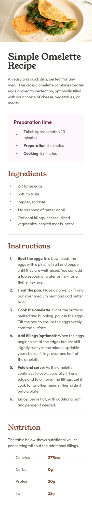

# Frontend Mentor - Recipe page solution

This is a solution to the [Recipe page challenge on Frontend Mentor](https://www.frontendmentor.io/challenges/recipe-page-KiTsR8QQKm). Frontend Mentor challenges help you improve your coding skills by building realistic projects.

## Table of contents

- [Overview](#overview)
  - [The challenge](#the-challenge)
  - [Screenshot](#screenshot)
  - [Links](#links)
- [My process](#my-process)
  - [Built with](#built-with)
  - [What I learned](#what-i-learned)
- [Author](#author)

## Overview

### Screenshot

### Links

- Solution URL: [Repo](https://github.com/Orliland/recipe-page)
- Live Site URL: [Live](https://orliland.github.io/recipe-page)

## My process

### Built with

- Semantic HTML5 markup
- CSS custom properties
- CSS Grid
- Mobile-first workflow

### What I learned

Something that I learned when doing this challenge was that images, being inline elements, have properties that affect the texts, which causes a blank space to be added below them. To avoid this problem, you must set the property `display: block;`.

## Author

- Website - [Orlando Verdin](https://orli.land)
- Frontend Mentor - [@Orliland](https://www.frontendmentor.io/profile/Orliland)
- Threads - [@Orliland](https://www.threads.net/Orliland)
